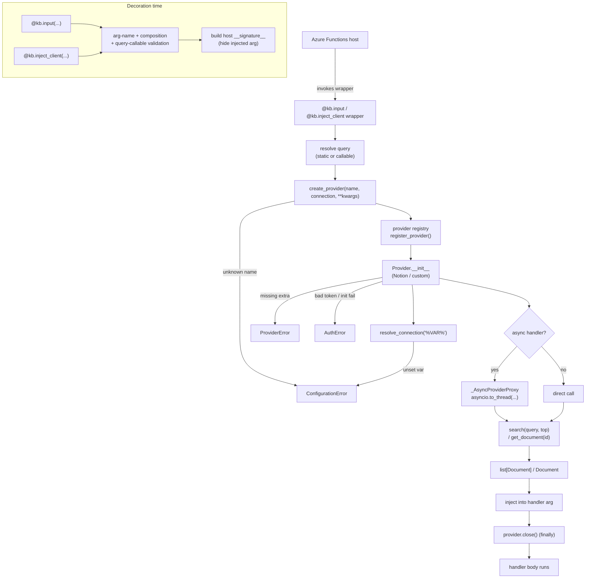

# Architecture

This page explains what happens between a decorated Azure Functions handler and
a knowledge provider, and provides the canonical architecture diagram for the
package. (`DESIGN.md` links here.)

## Components

| Component | File | Responsibility |
|-----------|------|----------------|
| `KnowledgeBindings` | `src/azure_functions_knowledge/decorator.py` | Public decorator API (`input`, `inject_client`). Validates arg names, composition, and query callables; builds the host-facing signature. |
| Provider registry | `src/azure_functions_knowledge/providers/base.py` | `register_provider` / `create_provider` / `get_registered_providers` over a process-wide name → class map. |
| `KnowledgeProvider` | `src/azure_functions_knowledge/providers/base.py` | Structural `Protocol` (`search`, `get_document`, `close`). |
| `NotionProvider` | `src/azure_functions_knowledge/providers/notion.py` | Built-in provider backed by the Notion API. |
| `resolve_connection` | `src/azure_functions_knowledge/auth.py` | `%VAR%` environment-variable substitution for connection strings. |
| `_AsyncProviderProxy` | `src/azure_functions_knowledge/decorator.py` | Wraps a sync provider so async handlers can `await` its calls. |
| `Document` | `src/azure_functions_knowledge/types.py` | Dataclass returned to handlers. |
| Errors | `src/azure_functions_knowledge/errors.py` | `KnowledgeError` hierarchy. |

## Request flow

At decoration time the binding validates configuration and replaces the handler
with a wrapper. At invocation time the wrapper resolves the query, creates a
provider, runs the operation, injects the result, and always closes the
provider. The diagram below includes the async offload path
(`_AsyncProviderProxy` / `asyncio.to_thread`), the `resolve_connection` step,
and the error paths.

The `input` decorator injects the **results** (`list[Document]`);
`inject_client` injects the **provider** (or an async proxy) so the handler
drives the calls itself.

## Async offloading

Providers are synchronous. When a handler is `async`, the binding keeps the
event loop responsive by offloading blocking I/O to a worker thread:

- `input` wraps the whole search (`create_provider` + `search` + `close`) in
  `asyncio.to_thread(...)`.
- `inject_client` injects an `_AsyncProviderProxy` whose `search` /
  `get_document` methods each call `asyncio.to_thread(...)` on the underlying
  provider, so the handler can `await` them.

## Provider lifecycle

A provider is constructed **per invocation** and closed in a `finally` block —
there is no connection pooling or caching across invocations. Keep constructors
cheap, or cache expensive resources at module scope inside your provider
implementation.

## Error paths

| Situation | Exception |
|-----------|-----------|
| Unknown provider name | `ConfigurationError` |
| Unset `%VAR%` in connection string | `ConfigurationError` |
| Invalid decorator usage / composition | `ConfigurationError` |
| Optional extra missing (e.g. `notion-client`) | `ProviderError` |
| Provider runtime/API failure | `ProviderError` |
| Bad credentials / mapping without token | `AuthError` |

## Notion provider behavior

`NotionProvider` (`providers/notion.py`) registers unconditionally so
`create_provider("notion")` reaches an actionable `ProviderError` when the
`[notion]` extra is missing. Content extraction walks child blocks depth-first
with pagination and recursion, bounded by `max_depth` / `max_blocks` and guarded
against cycles. Provider options are documented in the package docs.
